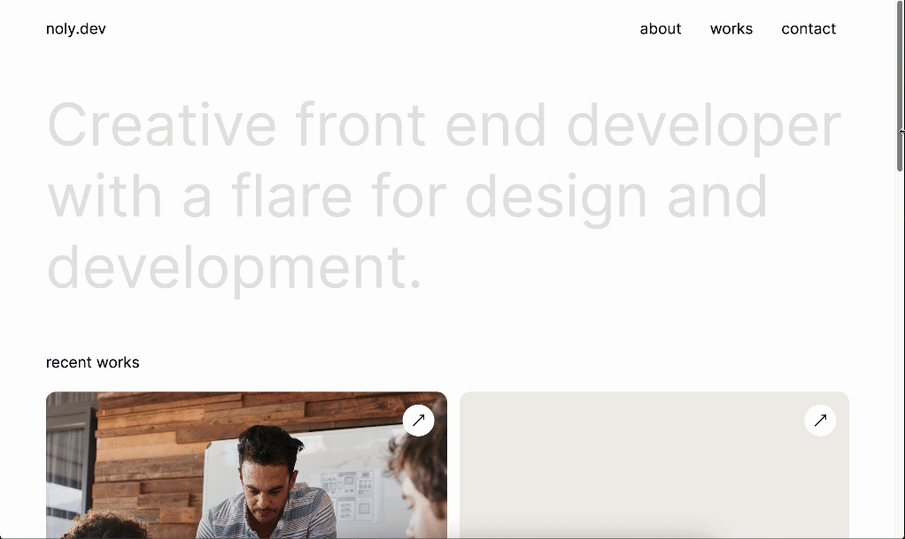

# Noly the Dev - Personal portfolio

## Description 

A minimal, clean and responsive personal portfolio built with HTML and CSS.

The link to the deployed Github page can be found [here](https://nolythedev.github.io/portfolio).

## Table of Contents (Optional)

* [Installation](#installation)
* [Usage](#usage)
* [Credits](#credits)
* [License](#license)

## Preview

## Installation

* Clone the repository: git clone https://github.com/nolythedev/portfolio
* Navigate to the project directory: cd portfolio
* Open the codebase in your preferred code editor.

## Usage 

N/A

## Credits

Thank you to the edX team.

## License

You are free to use this code as inspiration.
Please do not copy it directly.
Crediting the author is appreciated.

---

© 2023 edX Boot Camps LLC. Confidential and Proprietary. All Rights Reserved.
